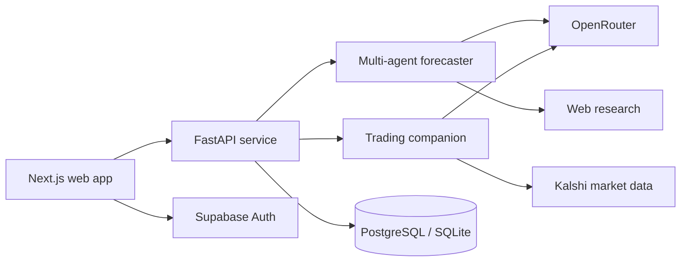

# Prism

**A social forecasting platform for turning beliefs about the future into calibrated probabilities and shareable prediction-market portfolios.**

[Live app](https://forecaster-black.vercel.app) · [Explore the model](https://forecaster-black.vercel.app/model)

Prism combines a multi-agent forecasting engine with live Kalshi market data. Users can research a binary question, express a broader thesis as a weighted basket of contracts, and publish that thesis for others to discover and follow.

## What it does

- **Agentic forecasting** — parses a question, establishes independent outside-view base rates, applies inside-view updates, reconciles disagreements, and returns a calibrated probability with an evidence trail.
- **AI basket construction** — interviews the user about a belief, maps it across relevant domains, screens live markets, and proposes a weighted portfolio of Kalshi contracts.
- **Manual basket studio** — lets users search markets, select outcomes, size positions, and save a thesis without the AI workflow.
- **Social research layer** — supports public and private theses, creator profiles, follows, personalized feeds, bookmarks, and performance views.

## Architecture



The forecasting pipeline separates outside-view reasoning from inside-view reasoning. Three base-rate agents build independent reference classes, a reconciler establishes a prior, inside-view agents update it, and a supervisor produces the final ensemble estimate. Platt scaling is applied before the result is returned.

## Tech stack

| Layer | Technology |
| --- | --- |
| Web | Next.js 16, React 19, TypeScript, Framer Motion |
| API | FastAPI, Pydantic, Uvicorn |
| AI | OpenRouter, structured multi-agent workflows |
| Markets | Kalshi API and local market caches |
| Data and auth | PostgreSQL with SQLite fallback, Supabase Auth |
| Deployment | Vercel and Railway |

## Repository map

```text
forecaster/           Core forecasting engine and CLI
trading_companion/    Belief analysis and basket-construction agents
prism/api/            FastAPI application and persistence layer
prism/frontend/       Next.js product experience
tests/                Deterministic forecasting unit tests
```

## Run locally

### Prerequisites

- Python 3.11+
- Node.js 20.9+
- An OpenRouter API key
- Kalshi credentials for live market data
- Supabase credentials for authentication features

### 1. Start the API

```bash
python -m venv .venv
source .venv/bin/activate
pip install -r requirements.txt
cp .env.example .env
uvicorn prism.api.main:app --reload --port 8000
```

Fill in the credentials you need in `.env`. Without `DATABASE_URL`, the API uses a local SQLite database.

### 2. Start the web app

```bash
cd prism/frontend
npm ci
cp .env.example .env.local
npm run dev
```

Open [http://localhost:3000](http://localhost:3000). The local API runs at [http://localhost:8000](http://localhost:8000).

## CLI forecasting

The forecasting engine can also run independently:

```bash
python -m forecaster forecast \
  "Will the Federal Reserve cut rates before July 2027?" \
  --runs 3 \
  --output forecast.json
```

## Configuration

| Variable | Purpose |
| --- | --- |
| `OPENROUTER_API_KEY` | Model access for forecasting and basket agents |
| `KALSHI_API_KEY` | Kalshi API identifier |
| `KALSHI_PRIVATE_KEY_FILE` | Path to a Kalshi private key file |
| `DATABASE_URL` | PostgreSQL connection string; optional locally |
| `SUPABASE_URL` | Supabase project URL used by the API |
| `SUPABASE_JWT_SECRET` | Validates authenticated API requests |
| `ALLOWED_ORIGINS` | Comma-separated CORS allowlist |
| `NEXT_PUBLIC_API_URL` | Browser-facing API base URL |
| `NEXT_PUBLIC_SUPABASE_URL` | Supabase project URL used by the frontend |
| `NEXT_PUBLIC_SUPABASE_ANON_KEY` | Supabase browser client key |

See the checked-in `.env.example` files for the full local templates.

## Quality checks

```bash
python -m unittest discover -s tests -v
python -m compileall -q forecaster trading_companion prism/api

cd prism/frontend
npm run lint
npm run build
```

## Disclaimer

Prism is a research and portfolio-construction project. Its forecasts and market views are not financial advice.
